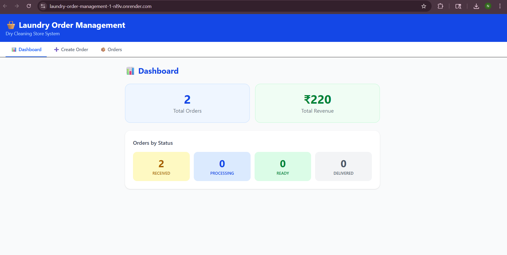
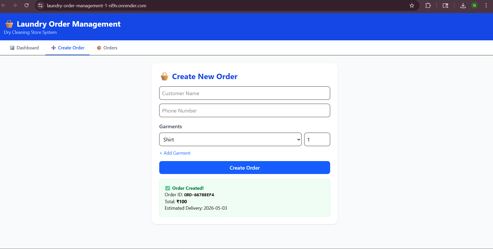
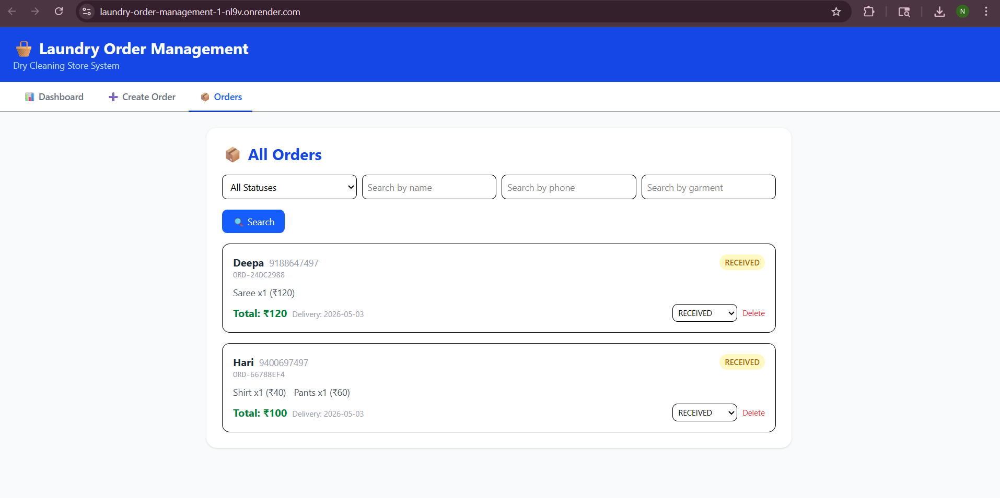

# 🧺 Mini Laundry Order Management System

A full-stack web application for managing dry cleaning orders — built with Node.js + Express backend and React + Vite frontend, connected to MongoDB Atlas.

🔗 **Live Demo:** https://laundry-order-management-1-nl9v.onrender.com  
📡 **API Base URL:** https://laundry-order-management-657i.onrender.com/api

---
## 📸 Screenshots
### 📊 Dashboard

.png)

### ➕ Create Order


### 📦 Orders Page

## ⚡ Quick Overview

- Full-stack laundry order management system
- Node.js + Express + MongoDB backend
- React + Vite frontend
- Features: order creation, tracking, filtering, dashboard
- Deployed on Render
## 💡 Why This Project

This project simulates a real-world laundry shop system, helping manage daily orders, track processing status, and generate billing efficiently.
## 🧾 Resume Description

Built a full-stack laundry order management system using Node.js, Express, MongoDB, and React. Implemented order creation, status tracking, filtering, and dashboard analytics. Deployed on Render with REST API and responsive frontend. Leveraged AI tools for rapid development and debugging.

## 🗂️ Project Structure

```
laundry-order-management/
├── config/
│   └── db.js                        # MongoDB connection setup
├── controllers/
│   ├── orderController.js           # Business logic (in-memory version)
│   └── orderController.mongo.js     # Business logic (MongoDB version)
├── data/
│   └── store.js                     # In-memory array storage
├── models/
│   └── Order.js                     # Mongoose schema & model
├── routes/
│   └── orders.js                    # All route definitions
├── frontend/                        # React + Vite frontend
│   ├── public/
│   ├── src/
│   │   ├── components/
│   │   │   ├── CreateOrder.jsx      # Create new order form
│   │   │   ├── OrderList.jsx        # List, filter & update orders
│   │   │   └── Dashboard.jsx        # Stats & revenue summary
│   │   ├── api.js                   # Axios API calls
│   │   ├── App.jsx                  # Main app with tab navigation
│   │   ├── main.jsx                 # React entry point
│   │   └── index.css                # Tailwind CSS
│   ├── package.json
│   └── vite.config.js
├── .env                             # Environment variables (git ignored)
├── .env.example                     # Env template
├── .gitignore
├── package.json
├── postman_collection.json
├── server.js                        # Entry point (in-memory)
└── server.mongo.js                  # Entry point (MongoDB)
```

---
## 🚀 Setup Instructions

### Prerequisites
- Node.js v18+
- npm
- MongoDB Atlas account (free tier)

### 1. Clone the repository

```bash
git clone https://github.com/Nandithaofficial/laundry-order-management.git
cd laundry-order-management
```

### 2. Setup Backend

```bash
npm install
cp .env.example .env
```

Edit `.env` and add your MongoDB URI:
```
PORT=3000
MONGO_URI=mongodb+srv://<username>:<password>@cluster0.xxxxx.mongodb.net/laundry_db?retryWrites=true&w=majority
```

Run backend:
```bash
# With MongoDB
npm run dev:mongo

# With in-memory storage (no DB needed)
npm run dev
```

Backend runs at: `http://localhost:3000`

### 3. Setup Frontend

```bash
cd frontend
npm install
npm run dev
```

Frontend runs at: `http://localhost:5173`

> ⚠️ Make sure `frontend/src/api.js` points to `http://localhost:3000/api` for local development.

---

## ✅ Features Implemented

| Feature | Status |
|---|---|
| Create order with garments, qty, pricing | ✅ |
| Auto-generate unique Order ID | ✅ |
| Auto-calculate total bill | ✅ |
| Estimated delivery date (3 days) | ✅ |
| Update order status (RECEIVED → PROCESSING → READY → DELIVERED) | ✅ |
| List all orders | ✅ |
| Filter by status, name, phone, garment type | ✅ |
| Get single order by ID | ✅ |
| Delete order | ✅ |
| Dashboard (total orders, revenue, per-status breakdown) | ✅ |
| In-memory storage | ✅ |
| MongoDB persistent storage | ✅ |
| React frontend (Vite + Tailwind CSS) | ✅ |
| Postman collection | ✅ |
| Deployed on Render | ✅ |

---

## 📡 API Reference

### Base URL
```
http://localhost:3000/api
```

### Endpoints

| Method | Endpoint | Description |
|---|---|---|
| POST | `/orders` | Create a new order |
| GET | `/orders` | List all orders (supports filters) |
| GET | `/orders/dashboard` | Dashboard summary |
| GET | `/orders/:orderId` | Get a single order |
| PATCH | `/orders/:orderId/status` | Update order status |
| DELETE | `/orders/:orderId` | Delete an order |

### Query Filters (GET /orders)

| Param | Example | Description |
|---|---|---|
| `status` | `?status=RECEIVED` | Filter by order status |
| `name` | `?name=Ravi` | Search by customer name |
| `phone` | `?phone=9876543210` | Search by phone number |
| `garmentType` | `?garmentType=Saree` | Filter by garment type |

### Create Order — Request Body
```json
{
  "customerName": "Ravi Kumar",
  "phone": "9876543210",
  "garments": [
    { "type": "Shirt", "quantity": 3 },
    { "type": "Saree", "quantity": 2 },
    { "type": "Pants", "quantity": 1, "pricePerItem": 70 }
  ]
}
```

### Default Price List

| Garment | Price (₹) |
|---|---|
| Shirt | 40 |
| Pants | 60 |
| Saree | 120 |
| Jacket | 150 |
| Suit | 200 |
| Kurta | 80 |
| Bedsheet | 100 |
| Other | 50 |

---

## 🖥️ Frontend Pages

| Page | Description |
|---|---|
| 📊 Dashboard | Total orders, revenue, breakdown by status |
| ➕ Create Order | Form to add customer, phone, garments |
| 📦 Orders | List all orders, filter, update status, delete |

---


## 🤖 AI Usage Report

### Tools Used
- **Claude (Anthropic)** — primary tool for scaffolding and code generation

### Sample Prompts Used
1. *"Build a Node.js Express REST API for a laundry order management system with in-memory storage, supporting create order, update status, filter orders, and dashboard endpoints."*
2. *"Add MongoDB version of the controller using Mongoose."*
3. *"Build a React frontend with Vite and Tailwind CSS with Create Order, Order List, and Dashboard pages."*
4. *"Generate a Postman collection JSON for all the API endpoints."*
5. *"Write a README with setup instructions, API reference table, and AI usage report."*

### What AI Got Right
- Express boilerplate and middleware setup
- Controller structure and separation of concerns
- UUID-based order ID generation
- Dashboard aggregation logic using MongoDB pipelines
- React component structure with Tailwind styling
- Postman collection JSON structure

### What I Had to Fix / Improve
- AI placed `/dashboard` route after `/:orderId` — Express caught it as an ID param. Fixed by moving it before the parameterized route.
- `api.js` was saved as `Api.jsx` — caused build failure on Render. Fixed by renaming to `api.js`.
- `axios` was missing from frontend `package.json` — added manually.
- AI didn't include `pricePerItem` override in create order — added for flexibility.
- Status updates needed `.toUpperCase()` normalization — added for robustness.
- CORS was blocking POST requests from the deployed frontend — fixed by adding manual CORS headers including `OPTIONS` method in `server.mongo.js`.
- MongoDB Atlas was rejecting connections from Render due to IP whitelist — fixed by allowing access from all IPs (`0.0.0.0/0`) in Atlas Network Access settings.

---

## ⚖️ Tradeoffs

### What I Skipped
- Authentication (no login/token system)
- Input validation library (Joi/Zod)
- Pagination on order list
- Unit tests

### What I'd Add With More Time
- JWT-based authentication
- Pagination and sorting on orders list
- Order history / status change log
- SMS notification on status update (Twilio)
- Better error handling UI on frontend
- Deploy frontend on Vercel for faster loads

---

## 🛠️ Tech Stack

| Layer | Technology |
|---|---|
| Backend | Node.js, Express |
| Database | MongoDB Atlas (Mongoose) |
| Frontend | React, Vite, Tailwind CSS, Axios |
| Deployment | Render (backend + frontend) |
| API Testing | Postman |


---

## 🚀 Setup Instructions

### Prerequisites
- Node.js v18+
- npm

### Installation

```bash
git clone https://github.com/Nandithaofficial/laundry-order-management.git
cd laundry-order-management
npm install
```

### Run (Development - In Memory)
```bash
npm run dev
```

### Run (Development - MongoDB)
```bash
npm run dev:mongo
```

### Run (Production)
```bash
npm start
```

Server starts at: `http://localhost:3000`

---

## ✅ Features Implemented

| Feature | Status |
|---|---|
| Create order with garments, qty, pricing | ✅ |
| Auto-generate unique Order ID | ✅ |
| Auto-calculate total bill | ✅ |
| Estimated delivery date (3 days) | ✅ |
| Update order status (RECEIVED → PROCESSING → READY → DELIVERED) | ✅ |
| List all orders | ✅ |
| Filter by status, name, phone, garment type | ✅ |
| Get single order by ID | ✅ |
| Delete order | ✅ |
| Dashboard (total orders, revenue, per-status breakdown) | ✅ |
| In-memory storage (no DB required) | ✅ |
| MongoDB storage (persistent) | ✅ |
| Postman collection | ✅ |

---

## 📡 API Reference

### Base URL
```
http://localhost:3000/api
```

### Endpoints

| Method | Endpoint | Description |
|---|---|---|
| POST | `/orders` | Create a new order |
| GET | `/orders` | List all orders (supports filters) |
| GET | `/orders/dashboard` | Dashboard summary |
| GET | `/orders/:orderId` | Get a single order |
| PATCH | `/orders/:orderId/status` | Update order status |
| DELETE | `/orders/:orderId` | Delete an order |

### Query Filters (GET /orders)
| Param | Example | Description |
|---|---|---|
| `status` | `?status=RECEIVED` | Filter by order status |
| `name` | `?name=Ravi` | Search by customer name |
| `phone` | `?phone=9876543210` | Search by phone number |
| `garmentType` | `?garmentType=Saree` | Filter by garment type |

### Create Order — Request Body
```json
{
  "customerName": "Ravi Kumar",
  "phone": "9876543210",
  "garments": [
    { "type": "Shirt", "quantity": 3 },
    { "type": "Saree", "quantity": 2 },
    { "type": "Pants", "quantity": 1, "pricePerItem": 70 }
  ]
}
```

### Default Price List
| Garment | Price (₹) |
|---|---|
| Shirt | 40 |
| Pants | 60 |
| Saree | 120 |
| Jacket | 150 |
| Suit | 200 |
| Kurta | 80 |
| Bedsheet | 100 |
| Other | 50 |

---

## 🤖 AI Usage Report

### Tools Used
- **Claude (Anthropic)** — primary tool for scaffolding and code generation

### Sample Prompts Used
1. *"Build a Node.js Express REST API for a laundry order management system with in-memory storage, supporting create order, update status, filter orders, and dashboard endpoints."*
2. *"Add garment type filter to the GET /orders endpoint."*
3. *"Generate a Postman collection JSON for all the API endpoints."*
4. *"Write a README with setup instructions, API reference table, and AI usage report."*

### What AI Got Right
- Express boilerplate, middleware setup (cors, json)
- Controller structure and separation of concerns
- UUID-based order ID generation
- Dashboard aggregation logic
- Postman collection JSON structure

### What I Had to Fix / Improve
- AI initially put the `/dashboard` route after `/:orderId` — Express would catch `/dashboard` as an ID param. Fixed by moving it before the parameterized route.
- AI didn't include `pricePerItem` override in the create order body — added so callers can pass custom prices.
- AI used `req.body.status` without `.toUpperCase()` normalization — added for robustness.

---

## ⚖️ Tradeoffs

### What I Skipped
- **Authentication** — no login/token system
- **Input validation library** — using manual checks instead of Joi/Zod
- **Pagination** — GET /orders returns all records

### What I'd Add With More Time
- JWT-based authentication
- Pagination + sorting on list endpoint
- Order history / status change log
- SMS notification on status update (Twilio)
- Frontend dashboard (React)
- Deploy to Railway or Render

---

## 📁 Project Structure

```
laundry-order-management/
├── config/
│   └── db.js
├── controllers/
│   ├── orderController.js
│   └── orderController.mongo.js
├── data/
│   └── store.js
├── models/
│   └── Order.js
├── routes/
│   └── orders.js
├── .env
├── .env.example
├── .gitignore
├── package.json
├── postman_collection.json
├── README.md
├── server.js
└── server.mongo.js
```